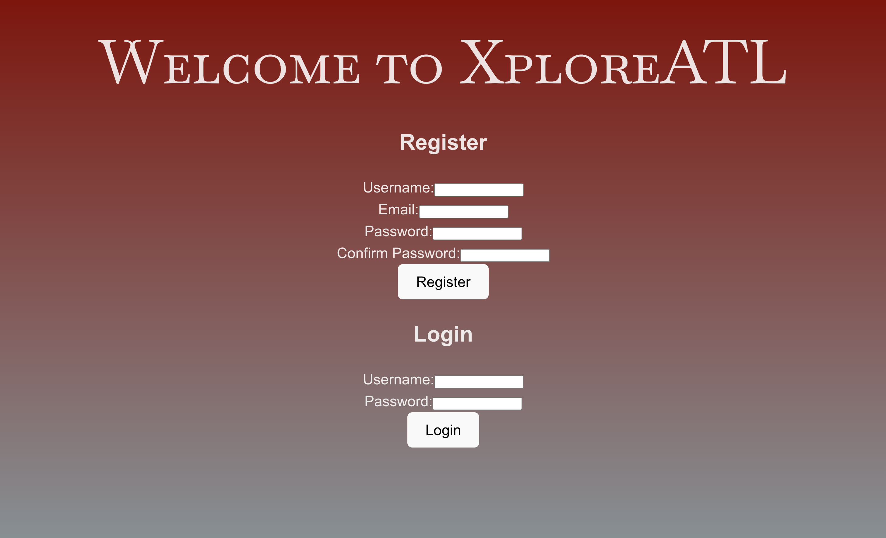
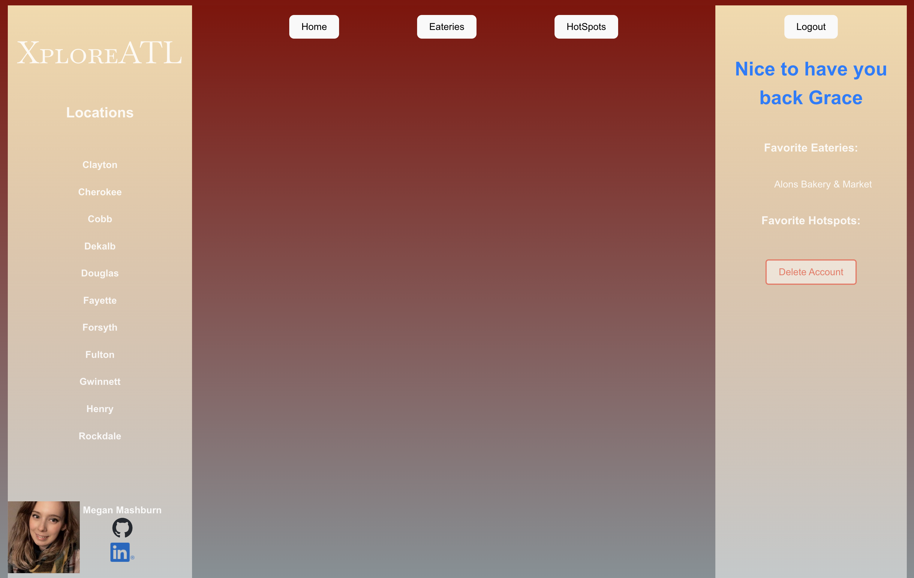
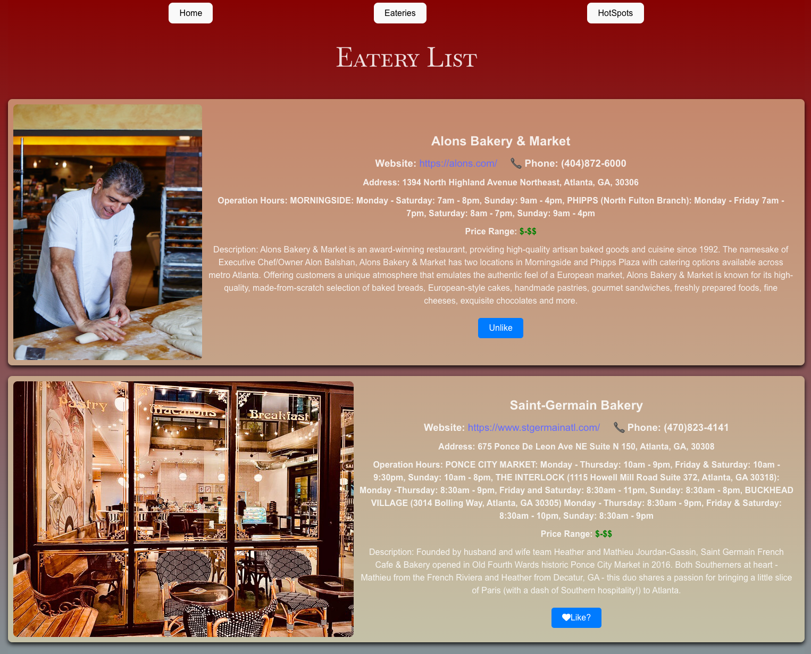

# Project Name: Explore Atlanta

### <u>Description:</u>

### XploreATL is a web application designed for locals and travelers to discover and explore various eateries and hotspots in their proximity. There is the ability to become a user to log and save your data as you explore Metro-Atlanta Georgia. Once the page has loaded detailed information about each place, including descriptions, locations, operating hours, and contact details will be available to you (user or not). Users will be able  to mark places as favorites or bookmark them for future reference. 

## Technologies Used:
### <u>Frontend:</u>
> HTML, CSS, JavaScript (ES6+), Font Awesome
> React.js, React Hooks (useState, useEffect, etc.)
> Passport(Passport-Local & Passport-local-Mongoose)
> Axios for HTTP requests
> Media Queries for responsive styling
### <u>Backend:</u>
> MongoDB for server-side logic for database management
> REST Framework for building APIs 
### <u>Version Control & CI/CD:</u>
> GitHub

## Project Features:
1. Categorized listings of eateries (restaurants, cafes, bakeries) and hotspots (daytime and nightlife spots).
2. Detailed information for each place, including descriptions, addresses, contact information, and operating hours.
3. Implement user authentication and authorization. (User registration and login/logout functionality. User profiles with options to manage favorite eateries and hotspots, and bookmark places.)
## Future Updates:
1. Deployment: AWS (Amazon Web Services) for hosting. Heroku for backend deployment.
2. Interactive Maps: Integration with maps (Google Maps API or Mapbox) to visualize the location of eateries and hotspots.
3. Enhance search and filtering capabilities. (Search functionality to find specific eateries or hotspots based on keywords or location. Filters to refine search results by category, price range, etc.)
4. Integrate user reviews and ratings for eateries and hotspots. Ability for users to share places on social media platforms.

## Wireframe & Diagram:
* [Figma ERD/Component](https://www.figma.com/board/qNRbo0XPas0OSJEJwKSiwY/Untitled?node-id=1-132&t=yufTu4Oy8VwMQYBf-0)
* [Figma Wireframe](https://www.figma.com/board/oBLN9kVHmQsbu99fMCJkOk/Untitled?node-id=0-1&t=R80mUlvWTTm8p1wD-0)
* [Trello](https://trello.com/b/pk6DEKuh/xploreatl)

## <u>Credits/Links to Socials:<u>
| Megan Mashburn |
| -------- |
||
|[GitHub](https://github.com/MyCloudAtl)|
|[LinkedIn](https://linkedin.com/in/megan-mashburn-075598194)|
